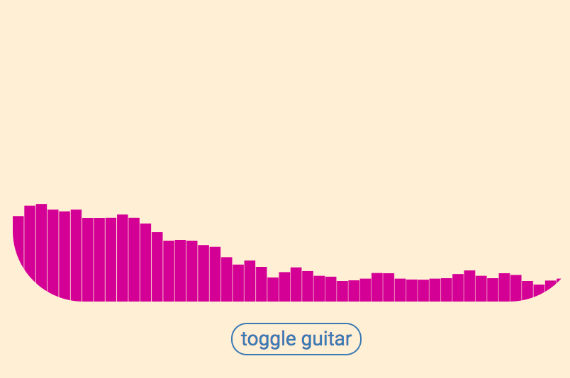
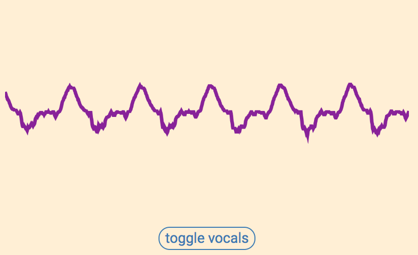
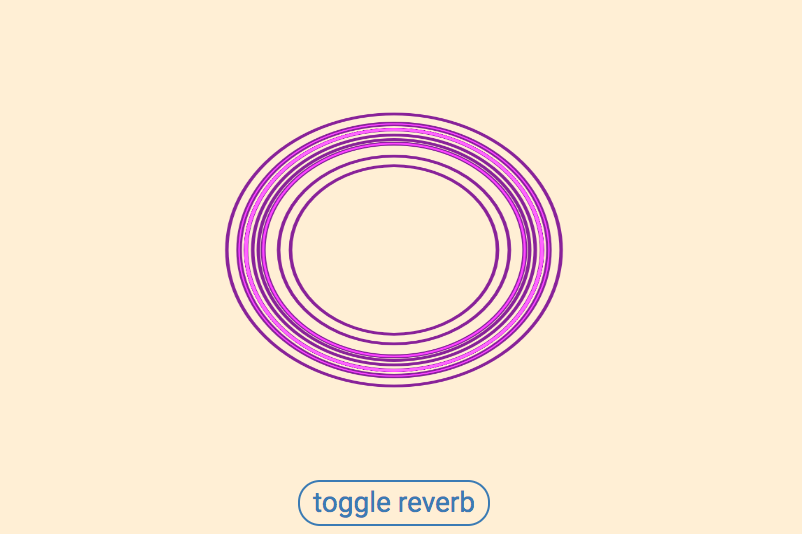

# [Audio Visualizer][audio-visualizer]

[audio-visualizer]: https://jonchaney.github.io/audio_visualizer

This project was inspired by my desire to create audio visualizations for my live music projects. I am very interested in ways in which web technoligies can be used to create interesting art and be used as tool for creative expression.

## Technologies

-  Web Audio API
- Javascript
- HTML/SCSS
- Webpack
- Canvas/Audio HTML5 elements

## Features

The main feature of this project is to display different tracks of the same recordings. The first is a classic sound bar visualization of the guitar track:

The second visualization is a waveform of a dry track of the vocals:

The third visualization is a combination of the first two tracks with added effects, such as echo and reverb.

# Future Plans

## Phase II:

- Reimplement playback function to utilize the Web Audio API multi-tracking feature
- Use a song with more tracks and allow the user to control the amount of reverb, echo, and eq for each track.
- Create other visualizations for additional tracks.

## Future, future, plans

I plan to build on these simple ideas to create interactive art that can be used during live music performances, as well as art that can stand on its own. 

Using The Web Audio API, Canvas, and Javascript I envision creating art that is both visually appealing and techinically interesting, with the ability to interact with it in a way that is similar to musical improvisation.

