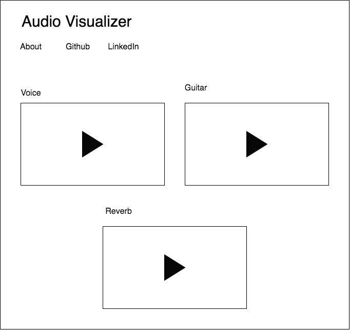

## Audio Visualizer

For this project I will create an audio visualizer using Javascript, CSS, the HTML Canvas element, and the Web Audio API.

## Funtionality and MVP

With my audio visualizer, users will be able to:

- Press play to start the visualization.
- View up to four different visualizations of the same audio source. One being the classic sound bar animation.

In addition, this project will include:

- Minimalist web design patterns, to provide a sleek, non-distracting interface
- A production Readme

## Wireframes

The app will consist of a single page, with four canvas elements, each showing different audio visualizations from the same audio source. You will be able to click on one for the song to start playing and the visualization to begin. Once you click on another the previous one will stop and the next one will play. There will also be a button to play all simultanously. 

There will be an About link, when clicking, a modal will appear with a brief explanation of the type of visualizations. There will also be a link to the github and my linkedIn.

## Architecture and Technologies

For this project I plan to use:

- Vanilla Javascript
- DOM Manipulation
- Canvas HTML element
- Web Audio API for extracting the data from the Audio file.
- Webpack to bundle and set up the files

The following scripts will be involved in this project:

`audio.js`: this is where the data for the audio will be stored. I will create methods and allow manipulation of the audio stream.

`main.js`: this is where I will write the JS and DOM manipulation to put the logic into the canvas element. 

## Implementation Timeline

**Day 1**: Get webpack, package.json running and create an entry file.

- Go over the Web Audio API and set up my audio.js file so I can create and Audio Object with a sound file saved as a instance variable.
- Test that I can do some basic extraction of the audio data to render something to the page.
- By the end of the day have the basic layout of my webpage done and have canvas elements rendered to the page. 

**Day 2**: Get a basic sound bar visualizer rendered on the page

- implement the sine and cosine sound wave methods in my audio.js file. 

**Day 3**: Create a pulse audio visualization

- implement a method in the audio.js file that analyzes the audio file and creates specifies output

**Day 4**: Create two other rendered canvas objects based on the previous two methods. 

- Use CSS to style something that shows my interest in design and creativity.

## Bonus Features

- [ ] Allow the user to upload a sound file to be visualized.